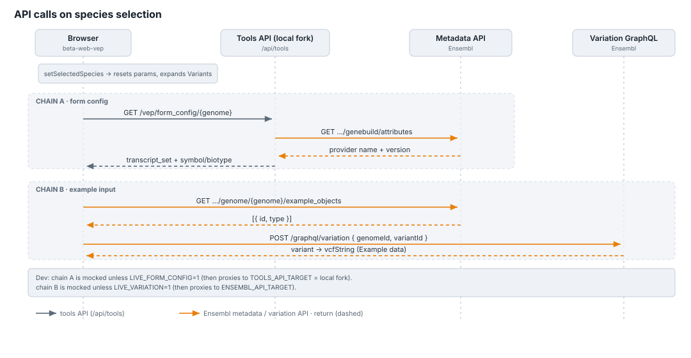

# VEP data flow

How variant data and metadata move through the VEP stack — what calls what, in
what order, and where each piece of the JSON specification takes effect.

Verified against the tools API implementation and its `ensembl-client` integration.

Companions: [spec-and-extension-guide.md](./spec-and-extension-guide.md) (the
grammar), [technical-notes.md](./technical-notes.md) (why the machinery is shaped
this way), [production-readiness.md](./production-readiness.md) (what remains to
validate before deployment).

## The rendered diagrams

Three self-contained, theme-aware SVG views live beside this document — no
runtime, no mermaid — in increasing detail. Each has a `.py` generator: edit the
data at the top and re-run, rather than hand-editing the output.

| file | shows | generator |
|---|---|---|
| `concept-map.html` / `.jpg` | **the shape of the thing** — four boxes and the traffic between them. Start here | `concept-map.py` |
| `dataflow-diagram.html` / `.jpg` | **the per-request sequence**, with the contract points tagged | `dataflow-diagram.py` (edit `EVENTS`) |
| `repo-overview.html` / `.jpg` | **the integration overview** — what lives where, the path a submission takes, and every hop that leaves the repositories. VEP slice only; the tools API also serves BLAST, not drawn | `repo-overview.py` (edit `NODES` / `EDGES` / `CONTRACTS`) |

The contract markers in those diagrams are the C1–C8 points, listed and
re-verified in
[technical-notes § The contract points](./technical-notes.md#the-contract-points).
Keep the two in step.

The three `dataflow-*.svg` files are the older, simpler views embedded inline
below.

## Contents

- [The whole flow in one picture](#the-whole-flow-in-one-picture)
- [Worked example — a variant with a pLI score](#worked-example--a-variant-with-a-pli-score)
- [Worked example — an allele frequency](#worked-example--an-allele-frequency)
- [Worked example — a filtered results page](#worked-example--a-filtered-results-page)
- [Workflow execution](#workflow-execution)
- [Species selection](#species-selection)
- [Metadata API reference](#metadata-api-reference)

---

## The whole flow in one picture

```
 ┌── FORM ────────────┐   ┌── SUBMIT ──────────┐   ┌ PIPELINE ┐   ┌── RESULTS ───────────┐
 │                    │   │                    │   │          │   │                      │
 │ GET /form_config   │   │ POST /submissions  │   │ VEP runs │   │ GET /…/results       │
 │        ↓           │   │        ↓           │   │    ↓     │   │        ↓             │
 │ get_visible_panels │   │ ConfigIniParams    │   │ output   │   │ parse with the PINNED │
 │        ↑           │   │  .options (map)    │   │ .vcf.gz  │   │ spec, not the live one│
 │ every option from  │   │        ↓           │   │ (one CSQ │   │        ↓             │
 │ its entry's `form` │   │ emit_config_lines  │   │ column   │   │ lay out with the      │
 │ block              │   │        ↓           │   │ per      │   │ PINNED display+panels │
 │                    │   │   config.ini       │   │ field)   │   │                      │
 └────────────────────┘   └────────┬───────────┘   └──────────┘   └──────────────────────┘
                                   │
                    pins 3 sidecars beside the job:
                      parsing_spec.json      the whole merged document
                      expected_columns.json  the CSQ columns these options must produce
                      display_panels.json    the panel/category layout as submitted
```

**The one idea to hold on to:** the spec is *pinned per job*. Results are parsed
and laid out with the document that existed at submission, so a job's options,
its parsing and its layout are provably one ruleset — and a spec change is
correctly invisible to jobs already submitted. Reloading an old job proves
nothing about a display change; make a new submission.

Where each spec section acts:

| section | acts at | reference |
|---|---|---|
| `config` | submit — turns selected options into `config.ini` lines | [guide §8](./spec-and-extension-guide.md#8-reference--the-config-section) |
| `form` (on a config entry) | form — the control itself, its panel, category and order | [guide §8.5](./spec-and-extension-guide.md#85-the-form-block) |
| `parsing` | results — CSQ columns → structured annotation | [guide §9](./spec-and-extension-guide.md#9-reference--the-parsing-section) |
| `display` | results — annotation → the rendered panel | [guide §10](./spec-and-extension-guide.md#10-reference--the-display-section) |

---

## Worked example — a variant with a pLI score

pLI is the simplest possible end-to-end case: one plugin, one column, one row.
It is also GRCh38-only, which shows how availability works.

**1 · The form.** `human_grch38.json` carries an entry whose `form` block names
the panel and category:

```jsonc
{ "id": "pli", "order": 46, "parsed_as": ["pli"],
  "form": { "panel": "genes_and_transcripts", "label": "pLI",
            "category": "Constraint", "type": "boolean",
            "default": false, "order": 150 },
  "config": { "emit": "plugin", "name": "pLI",
              "args": ["{path}/pli_transcript.txt", "transcript"] } }
```

`get_visible_panels` reads the *assembled* spec, so this control exists for
GRCh38 and simply is not there for GRCh37 — no branch anywhere says so.

**2 · Submit.** The browser posts `{options: {pli: true, …}}`.
`ConfigIniParams._resolve_options` completes the map from the spec (every option
this genome offers, at the sent value or the declared default) and
`emit_config_lines` writes:

```
plugin pLI,/…/pli_transcript.txt,transcript
```

Meanwhile `expected_csq_columns` records that this run must produce
`pLI_transcript_value`, and all three sidecars are pinned.

**3 · The pipeline** runs VEP, which appends `pLI_transcript_value` to each CSQ
entry.

**4 · Results.** The parse plugin — `scope: "transcript"`, so the value attaches
per consequence — reads that column into `pli.score`, and the display option
renders one row under the Constraint category of Genes & transcripts.

★ **The trap this example exists to record:** the plugin names its CSQ column
after its *argument*, so the column is `pLI_transcript_value`, not `pLI`. Find
the real name in a representative workflow output VCF's header — a wrong `csq_fields` produces no error,
just an option that never appears.

---

## Worked example — an allele frequency

Allele frequencies are the awkward case, because **the row set is a property of
the job, not of the variant**.

**1 · The form.** A single entry declares the control, and its sub-option tree
(ancestries × sexes) is *generated* from the same `fields=` builder table that
writes its config line — 122 of GRCh38's 169 option nodes come from there.

**2 · Submit.** The `custom` emitter builds a combinatorial `fields=` clause from
exactly the populations selected:

```
custom file=…/gnomad.genomes.v4.1.1.sites.vcf.gz,short_name=gnomAD_genomes,
       fields=AF%AF_afr%AF_nfe%AF_afr_XX,format=vcf,type=exact,coords=0
```

**3 · Results, the parse.** The `scalar` target reads the overall column; a
`pattern_map` target discovers the per-population columns **from the header** at
parse time, keyed by whatever sits between the pattern's prefix and suffix.

★ `csq_fields` names **one** sentinel column, not the per-population set. It
cannot name them: which populations exist depends on what the user selected, and
`expected_csq_columns` would then demand columns a narrower selection
legitimately never produces.

**4 · Results, the display.** A `map_rows` block takes its rows from the job's
**vocabulary** (`available_af_sources` on the response) rather than from the
data. That single fact is what makes both views work with no second code path:
the default view drops a population the variant has no value for, and "Show all"
lists every selected population with a dash.

See [guide §6](./spec-and-extension-guide.md#6-recipe-c--a-new-allele-frequency-source)
for the full recipe. The hand-written AF renderer that used to draw this was
deleted on 2026-08-09; there is now one path.

---

## Worked example — a filtered results page

Filters are the one part of the results path that is **not** spec-driven, because
it must decide per line, without building models.

```
GET /…/results?page=3&filters=[{"field":"cadd_phred","operator":">=","values":["20"]}]
   ↓
results_filters compiles each filter to a predicate over raw CSQ fields
   ↓
line_prefilter (literal-membership filters only): a cheap substring test on the
   UNSPLIT line — a necessary condition, so no false negatives
   ↓
full CSQ split only for lines that survive; per-entry evaluation
   ↓
a record is kept iff ≥1 of its CSQ entries matches, rewritten to just those entries
   ↓
page window assembled and parsed into the response model
```

An unfiltered request skips all of this and takes the BGZF page-index seek path
instead. A filtered one always full-scans — bounded in memory, but a scan.

See [technical-notes.md § Results filtering](./technical-notes.md#results-filtering)
for the measurements and the open question about no-data semantics.

---

## Workflow execution

The tools API orchestrates everything. External calls (orange):

- **Ensembl Web Metadata API** — genome metadata for the form config, and
  resolving the `gff` / `fasta` reference paths while building `config.ini`.
- **Seqera Platform** (Nextflow Tower) — launch the workflow, then poll status.
- **VEP reference data** — VEP reads the **GFF + FASTA** and plugin data paths
   the tools API writes into `config.ini`. This is GFF-based custom annotation,
   not the VEP cache.

The client separately calls Ensembl search / metadata / variation APIs for species
selection and example variants.

> The exact `vep` command is assembled by the external Nextflow pipeline
> (`NF_PIPELINE_URL`), which is not in this repo. But the `config.ini` the tools
> API supplies provides `gff` + `fasta` (no `cache` / `dir_cache` / `offline`), so
> annotation is GFF-based — consistent with output whose MANE designation appears
> in the `MANE` label column.

The API creates a per-submission work directory containing the uploaded VCF,
generated `config.ini`, and pinned sidecars, then launches the configured
Seqera workflow. Status, results, and downloads resolve through that workflow's
record and output path. The API and compute environment must both see the same
work directory and VEP support-data mount.

---

## Species selection

Selecting a species fires two request chains, plus some no-API side effects.



**Trigger** — `setSelectedSpecies({ species })` (`VepAppBar.tsx:59` or
`VepSpeciesSelector.tsx:102`); the reducer (`vepFormSlice.ts`) sets the species
**and resets `parameters = {}`**, which is what un-gates chain A.

**Chain A — form config** (`useVepFormConfig.ts`):

1. `GET /api/tools/vep/form_config/{genome_id}` (`vepApiSlice.ts:38`).
2. The tools API calls the **metadata API** in parallel:
   `GET …/genome/{genome_id}/dataset/genebuild/attributes?attribute_names=genebuild.provider_name&…provider_version&…last_geneset_update`
   and `GET …/genome/{genome_id}/explain`.
3. The attributes response builds the **Transcript set** dropdown (+ static
   `symbol`/`biotype`); the explain response supplies the assembly name used
   to select the option panels and validate a submission.
4. `setDefaultParameters()` seeds `parameters`, so the call will not re-fire until
   the species changes again.

**Chain B — example input** (`VepFormVariantsSection.tsx:58` →
`vepApiSlice.ts:41`):

1. `GET /api/metadata/genome/{genome_id}/example_objects` → `[{id, type}]`.
2. For the `type === 'variant'` entry: `POST /api/graphql/variation` with
   `{ genomeId, variantId }` → variant detail → `vcfString` (the "Example data").

**No-API side effects** — `parameters` reset to `{}`; the Variants section
auto-expands (`VepFormVariantsSection.tsx:65`).

---

## Metadata API reference

Three distinct upstreams are easy to conflate; only one is the **metadata API**:

| Upstream | Server-side (tools API) | Client-side (browser) |
|---|---|---|
| Metadata API | `WEB_METADATA_API` for form configuration, species presets, and GFF/FASTA lookup | `metadataApiBaseUrl` = `/api/metadata` |
| Search API (separate) | — | `searchApiBaseUrl` = `/api/search` |
| Variation GraphQL (separate) | — | `/api/graphql/variation` |

All server-side metadata calls share the `WEB_METADATA_API` base, so the form
configuration, species presets, and GFF/FASTA lookup use the same deployment
target.

**Server-side, stage 1 — form config.** `get_genome_genebuild()` and
`get_genome_assembly_name()`
(`app/vep/utils/web_metadata.py`), called from `get_form_config`
(`app/vep/vep_resources.py`).

- `GET …/genome/{genome_id}/dataset/genebuild/attributes?attribute_names=genebuild.provider_name&attribute_names=genebuild.provider_version&attribute_names=genebuild.last_geneset_update`
- Returns `{"attributes": [{"name","value"}, …]}`; the code reads
  `genebuild.provider_name`, `genebuild.provider_version`,
  `genebuild.last_geneset_update`.
- Builds the **"Transcript set"** dropdown label/value (e.g. `GENCODE 50`).
- `GET …/genome/{genome_id}/explain` returns the canonical `assembly.name`
  used to select form panels and validate submissions.

**Server-side, stage 2 — submission.** `get_vep_support_location()`
(`app/vep/utils/web_metadata.py`), called from `create_config_ini_file`.

- `get_genome_assembly_name(genome_id)` resolves the UUID before option
  validation, spec selection, and display-panel pinning; clients never send an
  assembly or taxonomy value with a submission.
- `GET …/genome/{genome_id}/vep/file_paths` → `{"faa_location","gff_location"}`;
  each prefixed with `VEP_SUPPORT_PATH` (default `/tmpdir`) to form the `fasta` /
  `gff` lines in `config.ini`.

**Client-side — species selection**
(`speciesSelectorApiSlice.ts`): `GET /api/metadata/popular_species`,
`GET /api/metadata/genome_group_categories`. Species *search* is
`GET /api/search/genomes/v2?…` — the **Search API**, not metadata.

**Client-side — example input** (optional):
`GET /api/metadata/genome/{genome_id}/example_objects` → `[{id, type}]`, then a
`POST /api/graphql/variation` for the variant.

★ The VEP backend calls `/genome/{id}/explain` for form-panel selection; the
client's shared `genomeApiSlice` still does not call it directly.

**Backend configuration** (`app/core/config.py`):

| Env var | Effect |
|---|---|
| `WEB_METADATA_API` | metadata API base (including a trailing `/`), for UUID-to-assembly resolution, form configuration, species presets, and GFF/FASTA lookup |
| `VEP_SUPPORT_PATH_ROOT` | contains GFF/FASTA support files and VEP plugin datafiles |
| `NF_WORK_DIR` | shared per-job input/output parent visible to the API and workflow compute environment |

Each job's sidecars are written beside its input and output files, ensuring that
results are parsed with the same spec, expected columns, and display panels used
at submission time.
